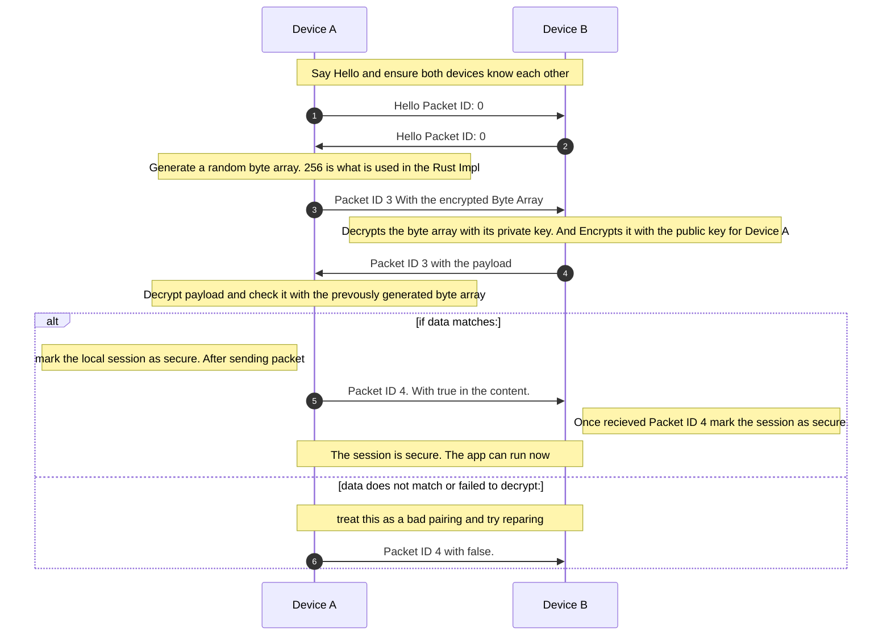
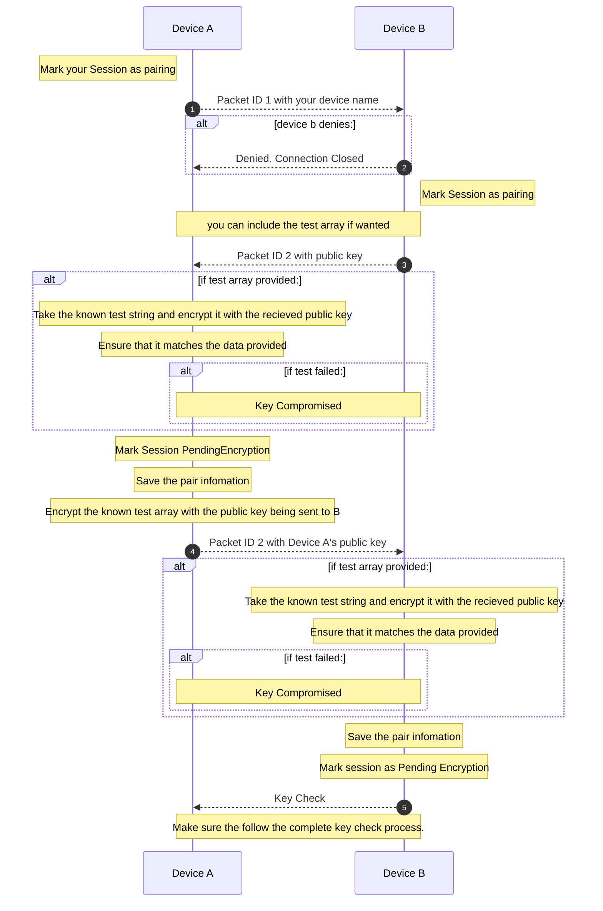

# Pairing and Key Checks

### Key Check - Packet ID 3 and 4

This should be done after Packet ID 0. Or the Hello Packet. To give context for the other connection

Secure Session works by Device A sending a random string encrypted with Device B's public key.  Then Device B will decrypt the message and send it back encrypted with Device A's Public Key.  

Once Device A recieves the payload again. They will verify it and mark the session as connected

Then packet id 4 back to Device B stating that the encryption is safe to be be secured

```json5
{
    protocol: 0,
    packet: 4
    content: true
}
```

### #### Diagram



### Device Pairing

#### Pair Request

The first step in pairing two devices together is to see device B wants to pair with you. This is done by first opening a TCP connection. Then sending the hello packet(id:0) and sending a packet 2

```json5
{
    protocol: 0,
    packet: 1,
    content: {
        device_name,
        Option<Bytes>/// Optionally you can include byte array of any other data you want. 
    }
}
```

If device B wants to connect it will send a packet 2 with its public_key and and optional test string

##### Optional Key Verifcation

The Optional Test. If you want to ensure that your key is the one sent to the other side. Pass a byte array for the test. This must be encrypted with the same key. On the other side they will need to know this string. They will use the public key provided to encrypt the known string If they are test the encrypted test and the known string(encrypted) are the same. The key has not been compromised.
Once the other side has a received the key they will use the public key to send you their key. And at this point both devices are paired They can move onto the Key Check to mark the session as secure.

### Pair Request Cont

Once you recieve this you can verify the test string if needed. Then sending a SendKey(Packet ID: 2 ) back to the Devce B: With your Public Key and the Test String encrypted with your key. You can now your change your session status from Pairing to Pending Encryption. Also save Device B as a paired device

Once the other side recieves this packet it will do the test and if everything is ok mark the session as pending encryption. Marking Device A as a paired device

At this point Device B will need to send a key check to change the session from Pending Encryption to Connected. sequenceDiagram
    autonumber
    participant A as Device A
    participant B as Device B
    note over A,B: Say Hello and ensure both devices know each other 
    A->>B: Hello Packet ID: 0
    B->>A: Hello Packet ID: 0
    note over A: Generate a random byte array. 256 is what is used in the Rust Impl
    A->>B: Packet ID 3 With the encrypted Byte Array
    note over B: Decrypts the byte array with its private key. And Encrypts it with the public key for Device A
    B->>A: Packet ID 3 with the payload
    note over A: Decrypt payload and check it with the prevously generated byte array
    alt if data matches:
        note left of A: mark the local session as secure. After sending packet
        A->>B: Packet ID 4. With true in the content.
        note right of B: Once recieved Packet ID 4 mark the session as secure. 
        note over A,B: The session is secure. The app can run now
    else data does not match or failed to decrypt:
        note over A,B: treat this as a bad pairing and try reparing
        A->>B: Packet ID 4 with false.
    end

##### Diagram


