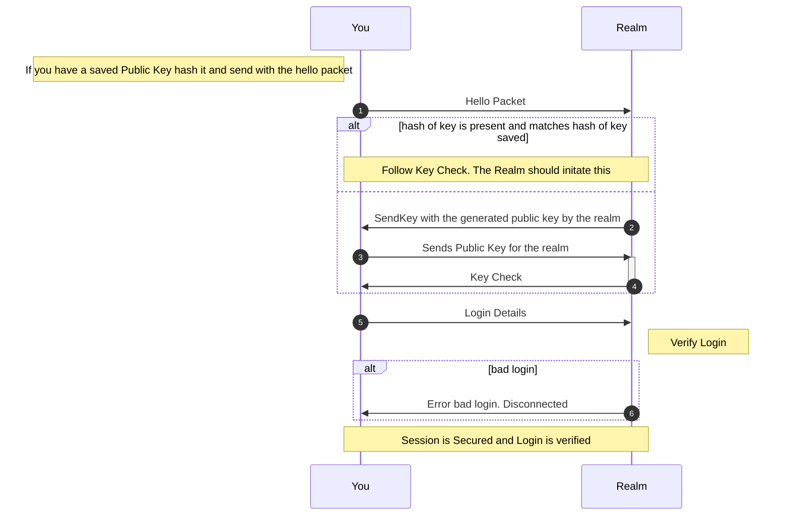

# Realms

```mermaid
sequenceDiagram
    autonumber
    participant A as You
    participant R as Realm
    note left of A: If you have a saved Public Key hash it and send with the hello packet
    A->>R: Hello Packet
    alt hash of key is present and matches hash of key saved
        note over A,R: Follow Key Check. The Realm should initate this
    else
        R->>A: SendKey with the generated public key by the realm
        A->>R: Sends Public Key for the realm
        activate R
        R->>A: Key Check
        deactivate R    
    end
    A->>R: Login Details
    note right of R: Verify Login
    alt bad login
    R->>A: Error bad login. Disconnected
    end
    note over A,R: Session is Secured and Login is verified
```
