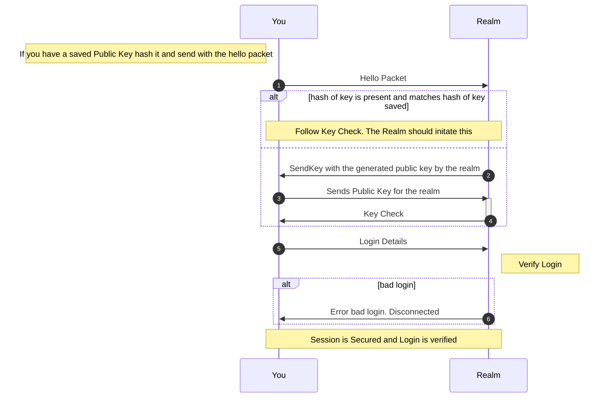

# Realms

### Realms Overview.

 

1. Proxy Realm Packets
   
   1. Placeholder. This is how it will look when sending and recieving the data
   
   2. The Realm will do the following steps
      
      1. Use the value target to know exackly where to send
      
      2. Encrypt the content with the key shared between the realm and the target device
   
   3. ```json5
      { 
      "protocol": 2, 
      "packet_id": {ID_FOR_PROXY_PASS}, // Currently pending confirmation
      "content": {
         "target": UUID // As two u64.
         "inner_content": {} //This is a normal device to device packet as byte array encrypted as  with the device key
       }
      }
      ```

2. You hold one connection to the realm no matter how many devices you are talking to through this realm

Realm Packet's

| Packet ID | Packet Name        | Description                                                                                                                          |
| --------- | ------------------ |:------------------------------------------------------------------------------------------------------------------------------------ |
| 0         | Heartbeat          |                                                                                                                                      |
| 1         | Error              |                                                                                                                                      |
| 2         | Hello              | Sent to the Realm and  will contain<br/> device_id and a optional hash of the public key the realm will need to communicate with you |
| 3         | Send Key           |                                                                                                                                      |
| 4         | Key Check          |                                                                                                                                      |
| 5         | Key Check Response |                                                                                                                                      |
| 6         | Device Login       |                                                                                                                                      |


